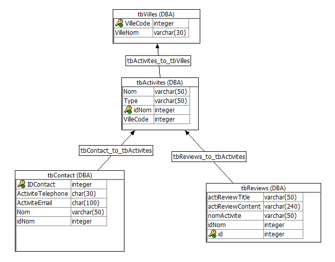

# ProjetEphec
Liste des tâches :
- [x] Créer un service sur Sybase
- [x] Créer la DB sur Sybase
- [x] Créer un ws d'affichage des villes (Florent)
- [x] Créer un ws d'affichage activités (Etolo)
- [x] Créer un ws d'affichage du contact pour l'activité (Dziemianko)
- [x] Créer un ws de review des activités (Julien)

## Présentation de l'équipe
Participants :
- Florent Biard (HE201813)
- Sebastian Dziemianko (HE201808)
- Julien Rahier (HE201801)
- Gabriel Etolo (HE201834)

## Description du projet
Notre projet consiste en un site qui répertorie des activités en fonction de la ville sélectionné par l'utilisateur. Cette ville va renvoyer les données vers des activités possibles à y effectuer. Les activités elles même vont renvoyer les contacts et les avis (avec la possibilité d’en laisser des nouveaux) vers cette activité quand on va les sélectionner. Ce site vise avant tout à aider les touristes visitant la Belgique et cherchant des activités à effectuer dans une ville.

## Aspects implémentés

### Frontend :
Projet.html : Base du site.

- CSS :
Projet.css : Feuille de style du site.

- JS :
Projet.js : Code JS gérant l’affichage des données sur le site.

### Backend :

#### Script-API-rest :

- GetCode-HE201834.sql : Procédure SQL servant à aller chercher les données (villeNom, villeCode) dans le tableau tbVilles et renvoyant les données grâce au webservice (code) qui va renvoyer les données en JSON.

- GetContact-HE21808.sql : Procédure SQL servant à aller chercher les données (ActivitesTelephone, ActivitesEmail) dans le tableau tbContact en fonction de l’activité sélectionné du tableau tbActivites et renvoyant les données grâce au webservice (contact) qui va renvoyer les donnes en RAW après les avoir transformés en HTML.

- GetPath-HE201834.sql : Procédure SQL servant à créer le lien grâce au nom du fichier.

- GetVille-HE201813.sql : Procédure SQL servant à aller chercher les données (nom, type) dans le tableau tbActivites en fonction d’un code externe (code = villeCode) et renvoyer les données grâce au webservice (GetVilles) qui va renvoyer les données en JSON.

#### Script base de données :

- tbActivites-HE201813.sql + insertionTbActivites-HE201813.sql : Code SQL de création et de remplissage du tableau tbActivites.

- tbContact-HE201808.sql + insertionTbContact-HE201808.sql : Code SQL de création et de remplissage du tableau tbContact.

- tbReviews-HE201801.sql : Code SQL de création du tableau tbReviews.

- tbVilles-HE201834.sql + insertionTbVilles-HE201834.sql : Code SQL de création et de remplissage du tableau tbVilles.

#### Script serveur web :

- GetCSS.sql : Procédure SQL joignant le dossier css à l’arborescence grâce à la procédure getPath et est appelé grâce au webservice ( CSS ). Qui va renvoyer la réponse en RAW grâce à la méthode GET .

- GetJS.sql : Procédure SQL joignant le dossier js à l’arborescence grâce à la procédure getPath et est appelé grâce au webservice ( JS ). Qui va renvoyer la réponse en RAW grâce à la méthode GET .

- GetPage.sql : Procédure SQL joignant le dossier html à l’arborescence grâce à la procédure getPath et est appelé grâce au webservice ( HTML ). Qui va renvoyer la réponse en RAW grâce à la méthode GET .

- Webservice-root.sql : Webservice SQL qui fait appelle à la procédure getPath.

## Détail api rest
- Code : Webservice SQL qui transforme les données en type JSON et qui appelle la procédure getCode grâce à la méthode GET. Toutes les autorisations pour cette fonction ont été initialisé à zéro par DBA (administrateur).

- Contact : Webservice SQL qui transforme les données en type JSON et qui appelle la procédure getContact grâce à la méthode GET. Toutes les autorisations pour cette fonction ont été initialisé à zéro par DBA (administrateur).

- CSS : Webservice SQL qui transforme les données en type RAW et qui appelle la procédure dba.http_getCSS grâce à la méthode GET. Toutes les autorisations pour cette fonction ont été initialisé à zéro par DBA (administrateur).

- getVilles : Webservice SQL qui transforme les données en type JSON et qui appelle la procédure sp_getVilles grâce à la méthode GET. Toutes les autorisations pour cette fonction ont été initialisé à zéro par DBA (administrateur).

- JS : Webservice SQL qui transforme les données en type RAW et qui appelle la procédure dba.http_getJS grâce à la méthode GET. Toutes les autorisations pour cette fonction ont été initialisé à zéro par DBA (administrateur).

- Page : Webservice SQL qui transforme les données en type RAW et qui appelle la procédure dba.http_getPage grâce à la méthode GET. Toutes les autorisations pour cette fonction ont été initialisé à zéro par DBA (administrateur).

- addReviews : Webservice SQL qui transforme les données en type RAW et qui appelle la procédure addReviews grâce à la méthode GET. Toutes les autorisations pour cette fonction ont été initialisé à zéro par DBA (administrateur).

- reviews : Webservice SQL qui transforme les données en type JSON et qui appelle la procédure getReviews grâce à la méthode GET. Toutes les autorisations pour cette fonction ont été initialisé à zéro par DBA (administrateur).

- root : Webservice SQL qui transforme les données en type RAW et qui appelle la procédure dba.http_getPage grâce à la méthode GET. Toutes les autorisations pour cette fonction ont été initialisé à zéro par DBA (administrateur).

## Détail DB
Notre base de données est constituée de quatre tableaux :
-tbVilles
-tbActivites
-tbContact
-tbReviews

L’arborescence des tableaux est comme suit. TbVilles et le premier tableau et il est lié au deuxième tableau tbActivites, ensuite sont lié au tableau tbActivites les tableaux tbContact et tbReviews.

La composition des tableaux est la suivante.

- tbVilles :
La tableau tbVilles est composé de deux colonnes de données, villeNom qui contient tous les noms des villes et villeCode qui contient leur code postal, celle-ci est la clé primaire.

- tbActivites :
Le tableau tbActivites est composé de quatre colonnes de données, nom qui est la clé primaire qui contient les noms des activités, type qui contient le type de l’activité en question, villeCode qui contient les codes postaux des villes où se situe l’activité et idActivité qui est l’id de l’activité en question. Ce tableau contient une clé étrangère vers le tableau tbVilles par villeCode.

- tbContact :
Le tableau tbContact est composé de quatre colonnes, la première étant idContact qui est la clé primaire et qui contient l’id des contacts à afficher, la deuxième est activiteTelephone qui contient un numéro de contact vers l’activité si celui-ci est disponible, la troisième est activiteEmail qui contient un mail de contact vers l’activité si celui-ci est disponible, la dernière colonne contient les noms de activités. Ce tableau contient une clé étrangère vers le tableau tbActivites par nom.

- tbReviews :
Le tableau tbReviews est composé de trois colonnes, la première colonne est actiReviewTitle qui contient un avis bref sur l’activité, la deuxième colonne est actiReviewContent qui contient un développement de cet avis, la troisième colonne est nomActivité qui contient le nom de l’activité celui-ci est la clé primaire du tableau. Ce tableau contient une clé étrangère vers le tableau tbActivites par nomActivite.

