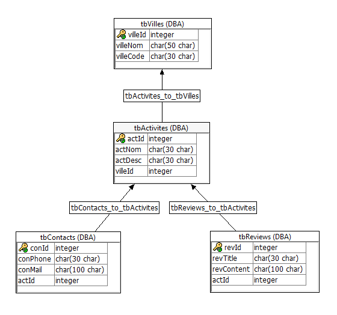

# ProjetEphec
Liste des tâches : 
- [x] Créer un service sur Sybase
- [x] Créer la DB sur Sybase

- [ ] Créer un ws d'affichage des villes
- [ ] Créer un ws d'affichage activités
- [ ] Créer un ws d'affichage du contact pour l'activité
- [ ] Créer un ws de review des activités (Julien)

## Présentation de l'équipe
Participants : 
- Florent Biard (HE201813)
- Sebastian Dziemianko (HE201808)
- Julien Rahier (HE201801)
- Gabriel Etolo (HE201834)

## Description du projet
// Notre projet est de concevoir un site dans lequel on retrouverait une dizaine de villes avec une énumération d'activités pour chacune d'elles

## Aspects implémentés
// La liste des aspects techniques qu'il faut implémenter pour mettre en place le projet, en séparant les aspects backend (base de données, procédures SQL, webservices, serveur de fichiers) et les aspects frontend (html, css, js, page web et fonctionnalités à proposer aux utilisateurs).

## Détail api rest
// Pour chaque webservice, vous devez indiquer le endpoint, les paramètre et le format de réponse. Indiquez aussi qui en est l'auteur. (Cela peut être "commun", mais il faut au moins 1 webservice complet personnel par membre du groupe.)
                                            
## Détail DB
// Présenter les tables et les champs des tables SQL

